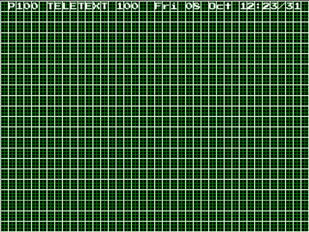

# A P I F A X 
ApiFax is a responisive imitation of teletext for modern web browsers.

Contents
1. [Why?!](#why)
2. [TeeFax](#teefax)
2. [Technologies Used and Design Choices](#tech)

##  Why?!
First, let's address the elephant in the room. ***Why*** does this exist?

At the time of creation I am currently learning web development. I have used API services in educational settings, but am yet to implement any in an actual project. 

Having grown up in the 90s I feel a strong nostalgia for technology of that time, and remember spending large amounts of time as a child scanning the pages of teletext while I waited for normal broadcasting to resume - *how times have changed!*

I decided a teletext imitation would be a good way to implement an API focused software in a manner that would be entertaining to myself. And like many of my more pointless projects, I enjoyed it, perhaps a bit too much..

##  T E E F A X
Whilst researching for this project, I came across a project called <a href="https://zxnet.co.uk/teletext/viewer/?channel=1&page=100" target="_blank">TeeFax</a>, by <a href="https://github.com/ZXGuesser" target="_blank">ZXGuesser</a>. TeeFax broadcasts a ceefax replica to raspberry pi devices connected to television sets via scart adapters. It was a valuable resource in recalling the aesthetic and behaviour of teletext, and I encourage any retro enthusiasts to go take a look!

##  Technologies Used and Design Choices

#### SCSS
The BBC ceefax pages were inidividually edited by hand *(and a computer)*, every page was unique and followed it's own layout design. I wanted to replicate this concept, and SCSS's nesting capabilities seemed a logical way to apply unique styling to each page.

#### CSS Grid

*The original grid layout, quickly abandoned in favour of efficiency!*

Originally, I had planned on following the original BBC CeeFax standard of a gridded display, consisting of 40 columns and 22 rows, with each cell consisting of 2 by 3 'pixels', and capable of a fill and/or border using an "on or off" rgb pallette. These standards can be observed at [edit.tf](https://edit.tf), where TeeFax users can design their own page art.

After making an index page, and mapping some very stylish header text, it quickly became apparent that this was far more work than it needed to be!

Instead, I decided to use CSS Grid styling to imitate the aesthetic. This method allowed my to quickly design visually authentic layouts, and also opened a door for better responsive design, allowing for better comfort of use on mobile devices.

#### Javascript
I wanted the UX to feel as authentic as possible, so this obviously had to be a *single page* application, we want to scan through the *ApiFax pages*, but without loading new *web pages* or changing url. 

Yes, I am aware that React or something similar might have been ideal for a project like this. However, I haven't got round to learning a frontend framework yet, and besides - there is something poetic about this project being written with none of the bells and whistles of a framework.

Having ***zero*** experience of designing a framework, I decided I should start with a basic template of what a page should be and how it should behave, and then build from there.

I ended up making objects to keep track of each pages markup, DOM caching, event listeners and page specific functions. A 'programme' object would handle the display and load pages, cache their DOM properties, and execute their event listeners and functions. A clear screen method would delete the necessary markup from the document and remove any listeners, allowing the browser to work with only one page at a time.

#### ExpressJS
I wanted the site to be static, but I needed to hide my API keys, so I built a small backend using Express. 

Express expects pages to be rendered using a temlating engine, however I was able to get around this by placing my index html file in the public folder, and redirecting get requests to the staticly served html file.

Without a rendering engine, I was unable to pipe data such as the API resonses and pageTemplates into the index page. A simple `fetch` call from the pages main javascript file solved this, with an `axios.get` being used on the backend to collect the API data.

#### SQLite
Despite desiging the site in a way that minimised API calls by calling once on page load, whilst testing I quickly found myself consuming my API quota's. I decided I could control this this by making requests once, and storing the data. I didn't feel that an entire database on another server was justified for such small amounts of data, so SQLite seemed the obvious choice.

I would have one table primarily to record the datetime of the most recent axios call, if it had been made longer than *X* hours ago, a new call would be made, and the responses would be logged in their own respective tables, ready to be fetched by the app. This would keep me well inside of my quotas... *hopefully.*